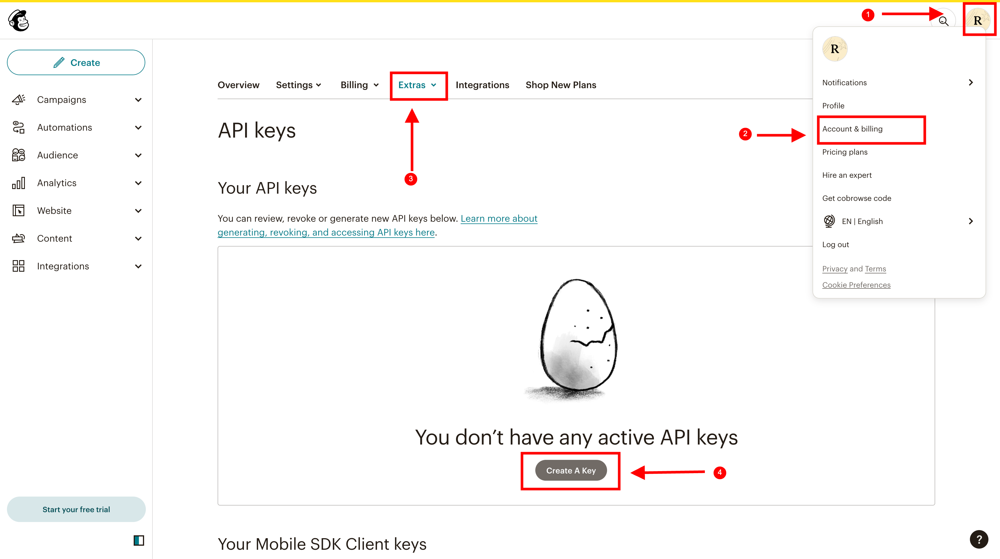
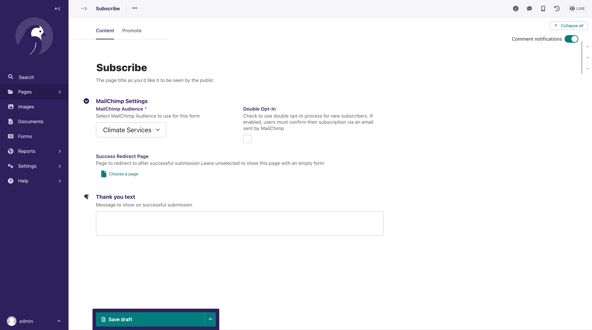
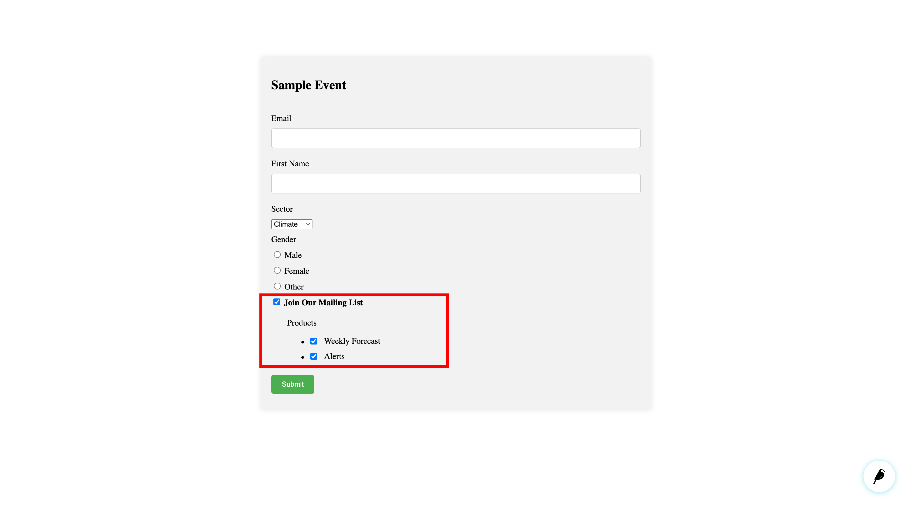
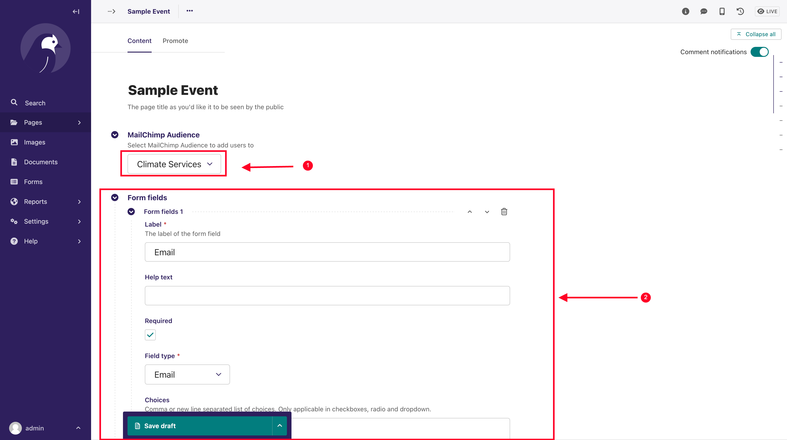
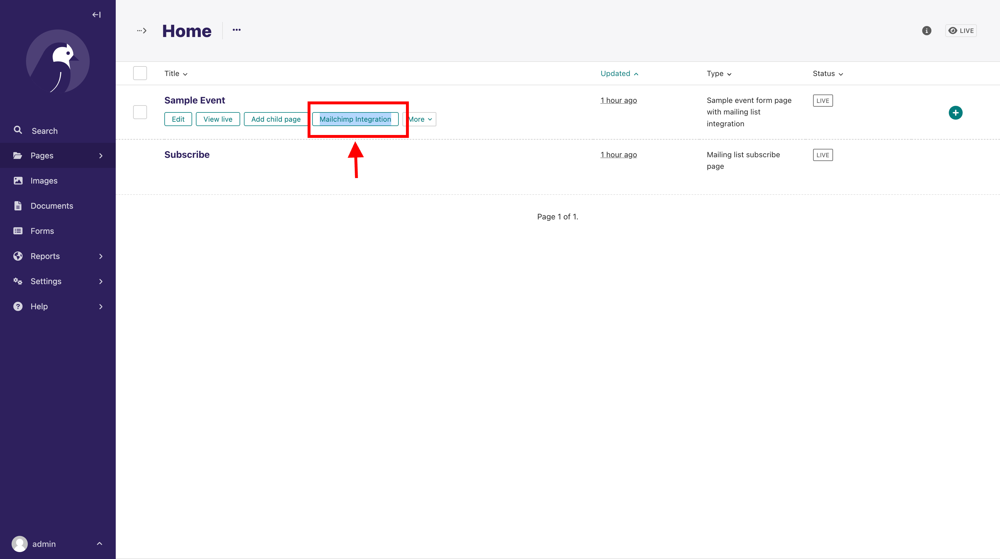
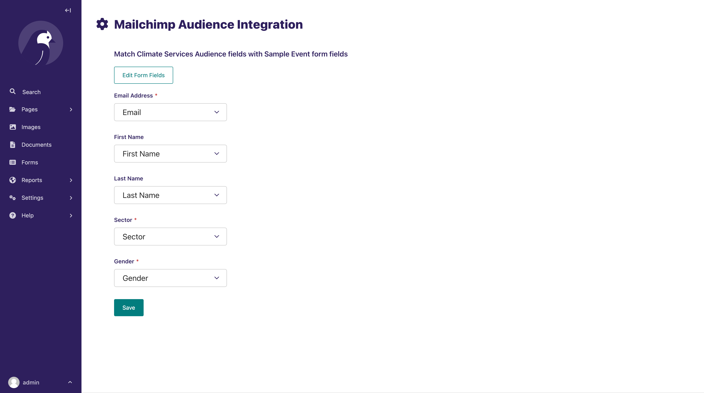

# Wagtail Mailchimp Integration

Integrate Mailchimp in Wagtail Project

## Features

- Add a Mailchimp Audience Sign Up Form to your Wagtail Page.
    - Benefit: Users can subscribe to your mailing list directly using a form hosted on your website.
- Integrate Mailchimp Audience subscription option to your custom form pages created with `Wagtail Form Builder`
    - Benefit: You have an event registration page? Why not use it to get subscribers to your mailing list!

## Installation

Install from pip

```shell
pip install wagtail-mailchimp-integration
```

Add `wagtailmautic` to your installed apps. Make sure `wagtail.contrib.settings` and `django_countries` is also added.

```
 INSTALLED_APPS = [
        ...
        "wagtailmailchimp",
        "wagtail.contrib.settings",
        "django_countries",
        ...
        ]
```

Run migrations

```
python manage.py migrate wagtailmailchimp
```

## Usage

### Mailchimp Settings

A Mailchimp settings section will be added to the `Settings` section of the Wagtail Admin.


The steps below explain how to add the setup the Mailchimp settings, as shown on the screenshot above

1. Click on Settings
2. Select Mailchimp Settings
3. Add the Mailchimp API Key. See next section on how to obtain the API Key.
4. Add an optional default Mailchimp Audience ID. You can follow the steps
   outlined [here](https://mailchimp.com/help/find-audience-id/)
5. Save

### Obtaining Mailchimp API Key

You need to obtain your API key from [Mailchimp](https://mailchimp.com/). Mailchimp provides a free trial that can get
you started if you do not have an account yet.

Below are the steps you can follow to get the API Key on Mailchimp, after logging in:



1. Click on your account profile icon
2. Select Account & billing
3. Click on Extras -> API Key
4. Create a new API Key, giving it an appropriate name, for example `CMS Integration`

Copy the API key that will be created.

### Adding a Mailchimp Audience Signup Form Page

Below is a sample snippet on how to set up a Wagtail page that will render a signup form to allow users signup to your
audience/mailing list

```python
# models.py

from wagtail.models import Page
from wagtailmailchimp.models import AbstractMailChimpPage


class MailingListSubscribePage(AbstractMailChimpPage, Page):
    parent_page_types = ['home.HomePage']
    template = "path_to_template.html"

    content_panels = Page.content_panels + AbstractMailChimpPage.content_panels

```

After running your migrations and adding the Page from the Wagtail Admin Explorer, the editor will look similar to the
screenshot below



Under Mailchimp Settings, you have the following fields:

- `Mailchimp Audience` - This is the Audience you want your users to sign up to
- `Double opt-in` - Check if you want to have an extra step which includes an extra confirmation step that verifies each
  email address. You can find More details on double op-tin [here](https://mailchimp.com/help/about-double-opt-in/)
- `Success Redirect Page` - optional Wagtail Page to redirect to after successful submission
- `Thank you text` - Message to show after successful submission, if no success redirect page provided

In your template, the `form` context will contain the Mailchimp audience signup form.

```html

<form method="POST">
    
    {{ form }}
    <div class="field">
        <button type="submit" class="button submit-button">Submit</button>
    </div>
</form>
```

You can style the rendered form and fields as you like.

### Integrating Mailchimp Audience subscription option to your custom form pages

Let's say you have a single-page form that
uses [Wagtail Form Builder](https://docs.wagtail.org/en/latest/reference/contrib/forms/).

You use this to building custom forms for collecting user information, say registrants to a workshop/event. You want to
have an option to allow these users to also subscribe to your mailing list.

The screenshot below shows what you aim to achieve - adding an option to allow users subscribe to your Mailchimp
audience:



The following snippet shows how you can achieve this:

```python
# models.py
from django.db import models
from modelcluster.fields import ParentalKey
from wagtail.admin.panels import InlinePanel
from wagtail.contrib.forms.models import AbstractFormField
from wagtail.models import Page

from wagtailmailchimp.models import AbstractMailchimpIntegrationForm


class FormField(AbstractFormField):
    page = ParentalKey('SampleEventFormPageWithMailingListIntegration', on_delete=models.CASCADE,
                       related_name='form_fields')


class SampleEventFormPageWithMailingListIntegration(AbstractMailchimpIntegrationForm):
    parent_page_types = ['home.HomePage']
    template = 'event_registration_page.html'
    landing_page_template = 'form_thank_you_landing.html'

    content_panels = Page.content_panels + AbstractMailchimpIntegrationForm.integration_panels + [
        InlinePanel('form_fields', label="Form fields"),
    ]
```

Run your migrations, and create the page from the Wagtail Admin Explorer.

The editor form will look similar to below:



1. Select the MailChimp Audience you want to integrate. This is a dropdown of the available audiences from your
   Mailchimp account
2. Set up your custom form fields to match your Mailchimp Audience Signup Form fields. Pay attention to field types with
   choices like `Checkboxes`, `Radio buttons` and `Dropdowns`, as the options must exactly match your Mailchimp signup
   form options.

Go back to the Wagtail Admin Explorer, and locate where the page you created is listed. Hover around the page title, and
you will see a button named `Mailchimp Integration` as below



Click it, and it will open a page, where you will match the Mailchimp signup form fields, with the fields in your form.

Make sure you do the matching correctly as this will inform Mailchimp on how to extract your user data from your Custom
form.

Once again, make sure for `choice options o=in your page form` match exactly
the `choice options in your mailchimp audience signup form`



After following the above steps and rendering the form in your template, the `Join Our Mailing List` checkbox will be
appended at the end of your form fields.

You can try it to make sure everything works and users are being added tou your mailing list before making the page
public.

You can find and follow a working sample in `sandbox/home/models.py` file
